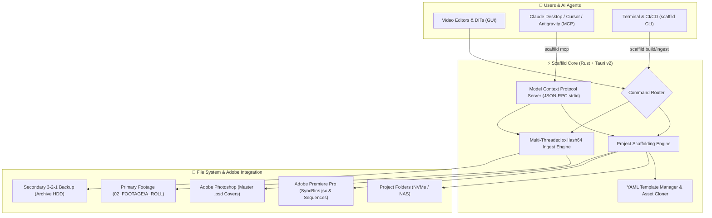

# Scaffild 🎬⚡

[](https://github.com/kcoaguila-dev/scaffild/actions/workflows/test.yml)
[](https://github.com/kcoaguila-dev/scaffild/releases)
[](LICENSE)
[]()
[]()
[]()

**Scaffild** is a modern, high-performance desktop post-production project scaffolding, DIT media offloading, and AI-native automation suite built with **Tauri v2**, **Rust**, **React 19**, and **TypeScript**.

Combining the capabilities of **Post Haste**, **ShotPut Pro ($149)**, and **Model Context Protocol (MCP)**, Scaffild automates folder hierarchy creation, genuine Adobe Premiere Pro (`.prproj`) & Photoshop (`.psd`) master asset cloning, dual-destination `xxHash64` media backup, and dynamic Premiere bin synchronization.

---

## 📥 Download & Installation

Ready-to-install release binaries are packaged in `dist-installers/` and available under **[GitHub Releases](https://github.com/kcoaguila-dev/scaffild/releases)**:

| Installer Format | File | Description |
| :--- | :--- | :--- |
| **Windows Setup Wizard** | `scaffild_0.1.0_x64-setup.exe` | Standard Windows installer with Start Menu & Desktop shortcuts |
| **Windows MSI Package** | `scaffild_0.1.0_x64_en-US.msi` | Enterprise & silent installation package |
| **Portable Standalone** | `scaffild-portable.exe` | Zero-install standalone executable (runs from USB or NAS) |

---

## 🏗️ System Architecture



---

## ✨ Key Capabilities

### 1. 🎬 Dedicated 16:9 & 9:16 Social Master Templates
* **`Horizontal_Video`** *(16:9 YouTube / Commercial / Narrative)*: Includes master 16:9 `.prproj`, `00_SELECTS_PULL` pancake timeline, `01_MAIN_MASTER_16x9`, and 16:9 Photoshop thumbnail (`[project]_Thumbnail.psd`).
* **`Social_Vertical_Reels_Shorts`** *(9:16 TikTok / Instagram Reels / YouTube Shorts)*: Includes true `1080×1920` portrait `.prproj` timeline, `00_SELECTS_VERTICAL`, `01_MASTER_REEL_9x16`, and 9:16 Photoshop cover with Instagram safe-zone guides.
* **`MultiFormat_Campaign`** *(Hybrid Commercial Suite)*: Includes both 16:9 longform and 9:16 cutdown timelines.

### 2. ⚡ 3-2-1 Checksum Media Offloader (DIT Grade)
* **Parallel Multi-Threaded I/O**: Stream camera cards to NVMe working drives and backup HDDs simultaneously.
* **`xxHash64` Hardware Checksums**: Verifies bit-for-bit integrity and generates an industry-standard `checksum_manifest.txt`.
* **Audio Completion Chime**: Web Audio synthesized audio notification upon completion.

### 3. 🔌 Dynamic Premiere Bin Sync (`SyncBins.jsx`)
* Automatically placed inside `01_PROJECT_FILES/` alongside your `.prproj`.
* In Premiere (**File > Scripts > Run Script File...**), mirrors all disk folders into bins and imports footage into matching bins.
* Automatically organizes timelines into a clean `00_SEQUENCES` bin.

### 4. 🤖 Built-in AI Agent Server (Model Context Protocol - MCP)
Connect **Claude Desktop**, **Cursor**, or **Antigravity** to Scaffild:
* AI Agents can autonomously list templates, scaffold project directories, and ingest camera cards using natural language.
* Access setup instructions in **Tools > AI Agent (MCP) Setup...**.

### 5. 💻 Headless Terminal CLI
```bash
# Start MCP server for AI Agents
scaffild mcp

# List available templates
scaffild list

# Build a project headlessly
scaffild build --template Horizontal_Video --target D:\Projects --title "Nike_Commercial" --open

# Ingest camera card with xxHash64 verification
scaffild ingest --source "E:\DCIM" --primary "D:\Projects\Footage" --secondary "F:\Archive"
```

---

## 🧪 Comprehensive Test Suite & Quality Assurance

Scaffild includes a multi-layered testing suite covering unit, integration, and end-to-end tests:

### 1. Run Rust Backend Tests (Unit, Integration & E2E)
```bash
cargo test --manifest-path src-tauri/Cargo.toml -- --nocapture
```
* `tests/template_tests.rs`: Validates YAML deserialization, UTF-8 BOM trimming, and parameter schemas.
* `tests/builder_tests.rs`: Validates end-to-end directory creation, asset cloning, `.prproj` GZIP XML sequence resolution integrity, and parameter interpolation.
* `tests/ingest_tests.rs`: Validates streaming dual-destination `xxHash64` copying, checksum manifests, and error recovery on corrupt sources.
* `tests/mcp_and_cli_tests.rs`: Validates JSON-RPC 2.0 MCP tools and CLI commands.

### 2. Run Frontend Tests (Vitest & Testing Library)
```bash
npm test
```
* `ui/TemplateTree.test.ts`: Validates tree conversion, Adobe badge detection, and raw structure roundtrip.

### 3. Production Build & Package
```bash
npm run tauri build
```

---

## 📄 License

Distributed under the [MIT License](LICENSE).
